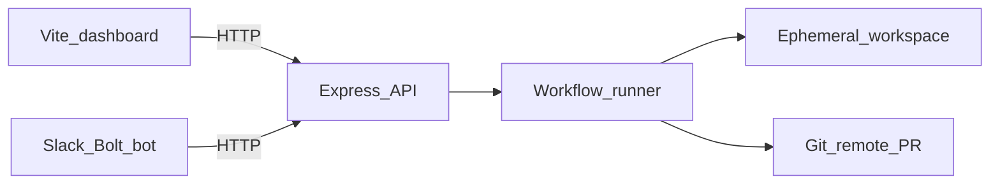

# Zeverse

Multi-repo AI workflow runner — one control plane (server + UI + optional Slack bot) that can drive dev, CI/CD, and custom workflows across any number of target repositories.

[](https://opensource.org/licenses/MIT)

[](CONTRIBUTING.md)

### Why Zeverse?

- **Multi-repo** — import many Git remotes; each run clones on demand (or uses an optional persistent workspace).
- **Workflow-as-code** — define steps under each target repo’s `.zeverse/workflows/`.
- **Multi-surface** — same REST API powers the dashboard, Slack, and scripting.
- **[Onboarding](#onboarding-a-new-repository)** — register repos, workflows, rules/skills context, integrations.
- **Policy + audit** — optional allowlists for repos/workflows/channels; audited harness executions in `state/audit.log`.
- **LLM** — documented default uses **CloudVerse** (`CLOUDVERSE_*`). The runner uses an OpenAI-SDK-compatible client; any compatible `base_url` + API key pairing may work if it matches that API shape.

```
zeverse/
├── config/zeverse.yaml   # Global LLM + runner config
├── repos.json           # Registry of imported repos
├── server/              # Express API + workflow runner (port 3100)
├── ui/                  # Vite + React dashboard (port 5173)
├── slack-bot/           # Slack Bolt bot (port 3200)
├── state/<repoId>/runs/ # Runtime run state + logs
└── repos/               # Default workspace for cloned repos
```

Workflows and commands live **inside each target repo** under `.zeverse/workflows/` and `.zeverse/commands/`. Zeverse itself is project-agnostic.

### Architecture



## Configuration reference

| Source | Purpose |
|--------|---------|
| [`.env.example`](.env.example) | Copy to `.env`; ports, `CLOUDVERSE_*`, `GITHUB_TOKEN`, Slack, integrations. **Never commit `.env`.** |
| [`config/zeverse.yaml`](config/zeverse.yaml) | Model, timeouts, paths, optional `policy` — substitutes `${CLOUDVERSE_BASE_URL}`, `${CLOUDVERSE_API_KEY}`, etc. |
| [`repos.json`](repos.json) | Imported repos (`id`, `origin`, `defaultBranch`). **Usually updated automatically** via the UI (**+ Import**), Slack/API `add-repo`, etc. The version in Git is only a starter example. See **[Onboarding a new repository](#onboarding-a-new-repository)** for rules and workflows per target repo. |

## Prerequisites

- Node.js ≥ 20
- npm ≥ 9
- git (used for ephemeral clones during workflow runs)
- `gh` CLI (optional — used for PR creation; falls back to GitHub REST API with `GITHUB_TOKEN`)
- `GITHUB_TOKEN` in `.env` (required for pushing branches and opening PRs on private repos)

## Quick start

1. Clone this repository.
2. Install dependencies:

   ```bash
   npm run install:all
   ```

3. Configure environment:

   ```bash
   cp .env.example .env
   ```

   Edit `.env`: set **`CLOUDVERSE_API_KEY`** and **`CLOUDVERSE_BASE_URL`** (see comments in [.env.example](.env.example)). For workflows that push or open PRs on private GitHub repos, set **`GITHUB_TOKEN`**. Optionally fill Slack vars to run **`slack-bot/`**.

4. Start services (each in its own terminal):

   ```bash
   npm run dev:server   # API — http://localhost:3100
   npm run dev:ui       # Dashboard — http://localhost:5173
   npm run dev:slack    # optional — Bolt app when Slack vars are set
   ```

5. Open http://localhost:5173 and use **+ Import** to register a target repo (or edit [`repos.json`](repos.json) if you prefer a file-first flow).

Smoke-check the API matches what the Slack bot expects: `npm run check:zeverse` (requires the server running).

The npm/workspace root package name is **`zeverse`**; cloning into a folder with that name matches the README paths.

## Onboarding a new repository

Steps for each **target repo** Zeverse will run against:

1. **Register in the hub** — Use **+ Import** in the dashboard, Slack/API `add-repo`, or append an entry to [`repos.json`](repos.json). You only need `git` remote URL plus the branch Zeverse should clone by default (`defaultBranch`).

2. **Define workflows** — In that repo add `.zeverse/workflows/*.yaml`. For Slack’s unified router, optionally add `.zeverse/workflows/harness.yaml`; otherwise server-side harness routing applies. See **[Adding workflows to a target repo](#adding-workflows-to-a-target-repo)**.

3. **Rules / skills (LLM context in every run)** — Zeverse does **not** read global Cursor Composer **Skills** (`~/.cursor/skills`). It concatenates repo-local Markdown in this **order**:

   - `.zeverse/rules/*.md`
   - `.cursorrules` (single file at the repo root)
   - `.cursor/rules/*.md`

   **Recommended:** bootstrap `.zeverse/rules/` via **+ Rules**, Slack **Add rules & skills**, or `POST /api/repos/<repo-id>/bootstrap-rules` (see **[Bootstrapping rules & skills](#bootstrapping-rules-skills)**) so the runner gets tech-stack, conventions, testing, domain, etc. **Optional:** keep `.cursorrules` / `.cursor/rules/` aligned with Cursor; Zeverse loads them automatically. If you rely on Composer skills elsewhere, copy the relevant guidance into `.zeverse/rules/` manually.

4. **Integrations (only when needed)** — Freshrelease-backed `fr-*` workflows need **`FRESHRELEASE_API_TOKEN`** in `.env` (see **[Freshrelease integration](#freshrelease-integration)**). Workspace follows **Freshrelease / Agile** URLs (`/ws/<workspace>/tasks/…` — analogous to a **Jira project** segment). Google Docs PRD flows need a service account JSON and sharing the doc (see **[Google Docs integration](#google-docs-integration-for-zeverse-prd)**).

## Importing repos

Supply a git URL via the UI, Slack, or API. Zeverse registers the remote URL
without cloning — each workflow run creates an **ephemeral clone** on demand,
pushes its results, and cleans up.

The registry is stored in `repos.json`:

```json
{
  "repos": [
    {
      "id": "zeverse",
      "name": "zeverse",
      "origin": "https://github.com/KeyurDiwan/zeverse.git",
      "defaultBranch": "main",
      "addedAt": "2026-05-02T00:00:00.000Z"
    }
  ]
}
```

### Migrating from the old format

If you have an existing `repos.json` with `path` fields, run the one-shot
migration script:

```bash
npx tsx server/scripts/migrate-repos.ts
```

This detects each repo's default branch via `git ls-remote`, drops the `path`
field, and writes the new format. A `.bak` backup is created automatically.

### How runs work (remote-first)

1. **Ephemeral clone** (default): `git clone --depth=50 --branch <base> <origin>`
   into `state/<repoId>/runs/<runId>/work/`. A run branch `zeverse/<wf>/<id>` is
   created on top.
2. **Managed workspace** (`keepWorkspace: true` in the workflow YAML): a persistent
   clone under `repos/<id>/` is fetched and hard-reset before each run. Only one
   run at a time per managed repo.
3. After steps complete, uncommitted changes are auto-committed, the branch is
   pushed to origin, and a PR is opened (via `gh` CLI or GitHub REST API).
4. Ephemeral workspaces are deleted after the run.

### Branch parameter

You can target a specific branch for a run:

- **API:** `POST /api/run-workflow` with `{ baseBranch: "my-branch" }`
- **UI:** Fill in the "Branch" input above the Run button
- **Slack:** Append `branch=my-branch` to your message, e.g.
  `@ZeverseBot fix the login bug branch=main`

Defaults to the repo's `defaultBranch` when omitted.

### Bootstrapping rules & skills

After onboarding a repo (see **[Onboarding a new repository](#onboarding-a-new-repository)**), you can auto-generate `.zeverse/rules/*.md` files — these
give the LLM context about the repo's tech stack, conventions, testing patterns,
and domain for every future workflow run. The bootstrap fingerprints existing `.cursorrules` and `.cursor/rules/` where present so drafts do not duplicate them.

**UI:** Click the **+ Rules** button next to any repo in the sidebar. A
`bootstrap-rules` run starts immediately; progress streams in the log pane.
When the run finishes it pushes a branch and opens a PR on the target repo.

**Slack:** After `add-repo` succeeds the bot posts an **Add rules & skills**
button. Click it to kick off the same run.

**API:**

```bash
curl -X POST http://localhost:3100/api/repos/<repo-id>/bootstrap-rules
# → { "runId": "..." }
```

The run clones the repo, fingerprints the codebase (directory tree, config
files, CI setup), sends the fingerprint to the LLM, and writes one `.md` file
per concern (e.g. `tech-stack.md`, `conventions.md`, `testing.md`). The PR
branch is named `zeverse/bootstrap-rules/<runId>`.

## Adding workflows to a target repo

Inside the target repo, create `.zeverse/workflows/<name>.yaml`:

```yaml
name: dev
description: Plan, implement, validate, review, PR.
inputs:
  - id: requirement
    label: Feature requirement
    required: true
steps:
  - id: plan
    kind: llm
    prompt: |
      Break this requirement into ordered tasks:
      {{inputs.requirement}}
  - id: validate
    kind: shell
    command: npm run lint && npm test -- --watchAll=false
    continueOnError: true
```

Step kinds:

| Kind           | Purpose                                            |
|----------------|---------------------------------------------------|
| `llm`          | Send a prompt to the configured LLM               |
| `review`       | Same as `llm`, semantically marked as a review    |
| `shell`        | Execute a shell command in the target repo         |
| `apply`        | Write files from fenced code blocks (`path=…`)    |
| `patch`        | Apply unified-diff patches via `git apply`        |
| `edit`         | Search/replace edits on existing files             |
| `gdoc-fetch`   | Fetch plain text from a Google Doc (via `docUrl`). Set `includeComments: true` to append existing comments. |
| `gdoc-comment` | Post comments on a Google Doc from a queries JSON  |
| `gdoc-reply`   | Reply to existing Google Doc comments (`repliesFrom`) |
| `gdoc-resolve` | Resolve Google Doc comment threads (`resolvesFrom`) |
| `gdoc-suggest` | Post suggest-edits on a Google Doc (`suggestsFrom`) |
| `fr-fetch`     | Fetch a Freshrelease task with all comments (`frUrl`) |
| `fr-create`    | Create FR issues from a fenced `fr-issues` JSON block (`contentFrom`) |
| `fr-comment`   | Post a comment on a Freshrelease task (`frUrl`, `bodyFrom`) |
| `workflow`     | Dispatch a child workflow (`workflowFrom`, `childWorkflow`, `inputsFrom`) |
| `approval`     | Pause the run and wait for a human to approve or reject before continuing (`surface: slack\|ui\|both`, `approvalTimeoutMs`) |
| `wait-thread-reply` | Pause the run, post a question in the Slack thread, and resume when the user replies (with optional file attachments: HAR, screenshots). `expectFiles`, `threadReplyTimeoutMs` |
| `har-analyze`  | Parse a HAR file and produce a structured summary of API calls grouped by status (failed, empty bodies, all). `harPathFrom`, `harPath`, `apiPrefix` |

Steps support an optional `when:` field — a template expression that is evaluated at
runtime. When the rendered value is empty, `"false"`, `"no"`, or `"0"`, the step is
skipped. This enables mode-driven branching within a single workflow.

### Step retries and loops

Any step can declare `retries` (number of retry attempts on failure) and
`retryBackoffMs` (base delay in ms; doubles each attempt). For iterative
convergence, use `loopUntil` (a template expression that re-evaluates after each
run; the step loops until it renders truthy) with `maxIterations` (default 10).

```yaml
- id: validate
  kind: shell
  command: npm run lint && npm test -- --watchAll=false
  retries: 2
  retryBackoffMs: 2000

- id: fix-loop
  kind: llm
  prompt: "Fix the failing tests: {{steps.validate.output}}"
  loopUntil: "{{steps.validate.output}}"
  maxIterations: 3
```

### Workflow-level options

| Field | Type | Default | Description |
|---|---|---|---|
| `isolation` | `"branch"` \| `"none"` | `"branch"` | Per-run git branch isolation. `"branch"` creates `zeverse/<wf>/<runId>`, commits, pushes, and opens a PR. |
| `keepWorkspace` | `boolean` | `false` | When `true`, reuse a persistent managed clone instead of an ephemeral per-run clone. Faster for large repos but serialises runs. |
| `gates` | `string[]` | `[]` | Step ids that must be `"success"` for the run to pass. Checked after all steps finish. |
| `onGateFail` | `{ childWorkflow: string }` | — | Dispatch this child workflow when gates fail (e.g. a "fix" workflow). |

### Approval gates

Add an `approval` step to pause the run until a human approves or rejects via
Slack buttons or the API:

```yaml
- id: approve-push
  kind: approval
  prompt: "Ready to push and open PR. Approve to continue."
  surface: slack
  approvalTimeoutMs: 600000   # 10 min timeout
```

The Slack bot posts Approve/Reject buttons in the run thread. API callers can
use `POST /api/runs/:id/approve` or `POST /api/runs/:id/reject`.

Shell steps run with `cwd` resolved against the session's working tree (the ephemeral or managed clone).

Templating uses `{{inputs.<id>}}` and `{{steps.<id>.output}}`.

## API

| Method | Path                          | Description                             |
|--------|-------------------------------|-----------------------------------------|
| GET    | `/api/repos`                  | List imported repos                     |
| POST   | `/api/repos`                  | Register a repo (`{url}`, optional `{name}`) |
| DELETE | `/api/repos/:id`              | Remove a repo from the registry         |
| POST   | `/api/repos/:id/refresh-workflows` | Force-refresh the cached workflows for a repo |
| POST   | `/api/repos/:id/bootstrap-rules` | Analyse codebase and open a PR with `.zeverse/rules/*.md` files |
| GET    | `/api/workflows?repoId=`      | List workflows for a repo               |
| POST   | `/api/run-workflow`           | Start a run (`{repoId, workflow, prompt, baseBranch?}`) |
| GET    | `/api/runs/:id?repoId=`       | Get run state                           |
| GET    | `/api/logs/:id?repoId=&offset=` | Tail run logs                         |
| POST   | `/api/gdoc-reply`             | Reply to a Google Doc comment (`{docId, commentId, body}`) |
| POST   | `/api/gdoc-comment`           | Post a Google Doc comment (`{docId, body}`; optional `anchor` verbatim substring—omit only if you intentionally want an unanchored / document-level comment) |
| POST   | `/api/gdoc-suggest`           | Apply tracked-change suggestions (`{docId, edits[]}`) |
| POST   | `/api/infer-repo`             | LLM-inferred repo selection (`{prompt}`) |
| POST   | `/api/harness/route`          | Unified routing (`{prompt, repoId?, threadContext?, surface}`) — returns `{type: proposal\|answer\|clarify, workflow, inputs, alternatives, confidence}` |
| POST   | `/api/harness/execute`        | Execute a confirmed workflow (`{repoId, workflow, inputs, prompt, slackUser?, channel?, surface?}`) — returns `{runId}`. Validates policy + required inputs. |
| GET    | `/api/runs/:id/events?repoId=&offset=` | Tail run events (NDJSON). Used for milestone polling. |
| POST   | `/api/runs/:id/approve`       | Approve a pending approval gate (`{by, comment?}`) |
| POST   | `/api/runs/:id/reject`        | Reject a pending approval gate (`{by, reason?}`) |
| POST   | `/api/runs/:id/thread-reply`  | Resume a `wait-thread-reply` step (`{by, text, files[]}`) |
| POST   | `/api/route-intent`           | Legacy shim — delegates to `/api/harness/route`, returns old format |
| POST   | `/api/smart-reply`            | Legacy shim — delegates to `/api/harness/route`, returns old format |
| GET    | `/api/policy`                 | Read-only policy config (`allowed_repos`, `allowed_workflows`, `allowed_slack_channels`) |
| GET    | `/health`                     | Health check                            |

## Policy & audit

Optionally restrict which repos, workflows, and Slack channels can trigger runs
by adding a `policy:` block to `config/zeverse.yaml`:

```yaml
policy:
  allowed_repos: ["repo1", "repo2"]
  allowed_workflows: ["dev", "fix-bug", "test-write"]
  allowed_slack_channels: ["C-TEAM-ZEVERSE"]
```

Use `["*"]` (the default) to allow anything. Violations return HTTP 403 with
a `reason` field.

Every successful `/api/harness/execute` call appends a JSON line to
`state/audit.log` recording the timestamp, Slack user, channel, repo, workflow,
run ID, and surface. Secrets are never written to the log.

## Observability

Each step transition emits an NDJSON event to `state/<repoId>/runs/<runId>.events.ndjson`.
Events include `step_started`, `step_finished`, `step_retry`, `step_skipped`,
`awaiting_approval`, `approved`, `gates_failed`, and `run_finished`.

The Slack bot polls `/api/runs/:id/events` and posts in-thread milestone messages
for steps listed in `runner.milestone_steps` (configurable in `config/zeverse.yaml`).

## Slack bot

Three surfaces, one pipeline. Every Slack interaction routes through the
**harness** — a unified entry point that picks the repo, selects the best
workflow, and **always asks for confirmation** before running.

### Harness flow

```
User message (slash / @mention / DM)
  → POST /api/harness/route (repo pick → keyword shortcut → LLM routing)
  → Bot posts: "I'd run `fix-bug` on `repo` — [Run] [Pick another…] [Cancel]"
  → User clicks Run
  → POST /api/harness/execute → startRun → poll → result in thread
```

Each target repo owns its routing logic via `.zeverse/workflows/harness.yaml`,
which contains an LLM routing step and a `workflow` dispatch step. The hub falls
back to server-side LLM routing when no harness.yaml exists.

### 1. Slash commands

```
/zeverse-dev     [<repo-id>] <your requirement>
/zeverse-harness [<repo-id>] <anything>
/zeverse-prd     [<repo-id>] <google-doc-url>
```

`/zeverse-harness` is the **universal command** — it accepts any natural-language
prompt and an LLM-based intent router picks the best workflow automatically:

| Prompt style | Routed to |
|---|---|
| "fix the login redirect loop" | `fix-bug` |
| "review my branch vs origin/main" | `code-review` |
| "explain src/store" | `explain-codebase` |
| "add a dark-mode toggle to settings" | `dev` |
| "how does billing routing work?" | `ask` (read-only Q&A) |
| "bump react to 19" | `upgrade-dep` |
| `https://freshrelease.com/ws/BILLING/tasks/BILLING-123` | `fr-task-finisher` |
| "create epic for onboarding flow" | `fr-card-creator` |
| "analyze FR BILLING-10444" | `fr-analyze` |
| "write tests for src/pages/billing/InvoiceList.tsx" | `test-write` |
| "raise PR" | `pr-raise` |
| "debug the invoices page" | `debug` (interactive thread) |
| `https://docs.google.com/document/d/…` | `prd-analysis` |

The router posts the chosen workflow + reason in Slack with **Run / Pick another
/ Cancel** buttons. The workflow only executes after the user clicks **Run**.
If the LLM can't confidently pick a workflow (confidence < 60%), it answers the
question directly instead.

When the user picks a write-capable workflow (`fix-bug`, `dev`, `lint-fix`),
edits are applied to disk and the result includes a diff summary, review verdict,
and a PR link (when available).

**Thread follow-ups:** `@mention` the bot inside a harness thread and it
re-routes the new prompt with full thread history as context — so "now fix it"
works after a diagnosis.

`/zeverse-prd` reads the PRD from the linked Google Doc, analyses it against the
repo codebase, posts open queries as comments on the doc, and replies in-thread
with a finalised/not-finalised verdict plus a summary of the top open questions.

After every analysis the bot also:
- Shows the **total open question count** and how many are **critical**.
- Posts each **critical question** as its own Slack message with a user-picker
  so you can assign an owner. When an owner is picked, the assignee receives a
  DM with a link to the Google Doc comment and the Slack thread.
- **Always** shows *Raise PR / Cancel* buttons (even when the deliverable step
  produced no output — clicking Raise PR in that case shows an error).

**Severity field in the workflow prompt:** The target repo's
`.zeverse/workflows/prd-analysis.yaml` `analyse` step must emit a `severity`
field per query (`"critical"` or `"nice-to-have"`). Mark a question critical
only when the PRD cannot be implemented without an answer (e.g. missing API
contract, undefined data shape, conflicting requirement). Example:

```json
[
  { "anchor": "...", "body": "...", "severity": "critical" },
  { "anchor": "...", "body": "...", "severity": "nice-to-have" }
]
```

Queries without a `severity` field default to `"nice-to-have"`.

Each `anchor` must be an **exact contiguous substring** copied from the PRD (heading or sentence). Zeverse resolves it against the fetched doc text and passes it to Google Drive as `quotedFileContent` so comments attach to highlighted passages (not document-level threads); deep links use `?disco=` as usual. **Queries whose anchor cannot be matched are skipped**—nothing is posted for that row—so every posted Google Doc comment is anchored.

**Clarification questions only:** Open questions in the `queries` JSON (and Slack-facing bullet questions) should address **product and implementation clarity**—missing requirements, ambiguities, inconsistencies, feasibility vs the codebase—not grammar, spelling, typos, or copy-editing. The Zeverse runner adds extra LLM system instructions for the `prd-analysis` workflow so editorial nitpicks are discouraged; repo prompts should align with the same rule.

### 2. @mentions (tag the bot in any channel)

Invite the bot to a channel, then tag it. The bot routes through the same
harness pipeline — answers questions directly, asks clarifying questions for
ambiguous requests, and shows confirm buttons before running workflows:

```
@ZeverseBot how does the billing router work?          # answered directly via LLM
@ZeverseBot fix the login bug                          # proposes fix-bug → [Run] [Pick another] [Cancel]
@ZeverseBot fix something                              # asks "Which repo / what exactly is broken?"
@ZeverseBot repoName pr-review fix flaky login test      # proposes pr-review → confirm buttons
@ZeverseBot help                                       # friendly greeting + capabilities
```

### 2a. @mentions inside PRD threads

When the bot is @mentioned inside a Slack thread that was started by `/zeverse-prd`,
it recognises special commands that sync the thread discussion back to the Google Doc:

```
@ZeverseBot update the PRD doc     # reads thread, posts answers + summary comment + tracked-change suggestions
@ZeverseBot answer this            # reads thread, posts answers + summary comment (no doc body edits)
```

**"answer this"** reads the full thread history, matches answers to the original
open queries, and posts:
- A reply on each matched Google Doc comment with the synthesised answer.
- A single top-level summary comment on the doc recapping all resolutions.

**"update the PRD doc"** does everything "answer this" does, plus produces
tracked-change suggestions on the PRD body itself (e.g. updating sections that
the discussion resolved). When the service account has **Commenter** access the
edits land as suggestions the PRD owner can accept or reject; with **Editor**
access they become direct writes.

Recognised trigger phrases:
- Update: `update`, `edit`, `apply`, `update prd`, `update the doc`, `update prd doc`
- Answer: `answer`, `answer this`, `reply`, `respond`, `post answers`

Any other @mention text in a PRD thread falls through to the harness pipeline.

### 3. Direct message

DM the bot (no mention needed). Same harness behaviour as @mentions — it answers
questions, asks clarifying follow-ups, or proposes workflows with confirm buttons:

```
how does the billing router work?
fix the login bug in repoName
```

### Slack app setup

In your Slack app manifest / settings:

- **Bot Token Scopes**: `app_mentions:read`, `chat:write`, `commands`, `im:history`,
  `im:read`, `im:write`, `users:read`, `channels:history`, `groups:history`
- **Event Subscriptions**: subscribe the bot to `app_mention` and `message.im`
- **Interactivity**: enable Interactivity & Shortcuts (for the confirm buttons)
- **Slash Commands**: `/zeverse-dev`, `/zeverse-harness`, `/zeverse-prd`, `/zeverse-add-repo`
  - `/zeverse-harness` uses the unified harness router (`/api/harness/route`)
  - `/zeverse-add-repo` registers a new repo (admin-only, see below)
- **Socket Mode**: enabled (set `SLACK_APP_TOKEN` with scope `connections:write`)

Defaults:
- **Repo**: if `<repo-id>` is omitted the bot first checks `ZEVERSE_DEFAULT_REPO_ID`.
  If that is unset, it asks the LLM to pick the best-matching repo from the
  registry (or auto-selects when only one repo exists).
- **Workflow**: determined automatically by the harness router (keyword matching
  then LLM). Falls back to `ask` when confidence is low.

### Adding repos from Slack

Authorized users can register new repos directly from Slack without opening the
UI. Three surfaces are supported:

```
@ZeverseBot add-repo <git-url> [optional-name]
/zeverse-add-repo <git-url> [optional-name]
DM the bot: add-repo <git-url> [optional-name]
```

Examples:

```
@ZeverseBot add-repo https://github.com/freshdesk/repoName.git
@ZeverseBot add-repo https://github.com/freshdesk/repoName.git my-custom-name
/zeverse-add-repo https://github.com/freshdesk/freshid-ui-v2.git
```

**Authorization:** adding repos is gated by two independent checks:

1. **User allowlist** — `ZEVERSE_REPO_ADMIN_USER_IDS` in the **Zeverse repo root**
   `.env` (same file as `SLACK_BOT_TOKEN` — not a separate `slack-bot/.env` unless
   you duplicate the line there). Comma-separated Slack user IDs. If empty, no
   one can add repos from Slack. Restart the bot after changing.
2. **Channel allowlist** — `policy.allowed_slack_channels` in
   `config/zeverse.yaml` (default `["*"]` = any channel). DMs are exempt from
   the channel check.

Both checks must pass for the operation to proceed.

### Google Docs integration (for `/zeverse-prd`)

1. Create a Google Cloud service account and download its JSON key.
2. Place the JSON at `config/gcp-service-account.json` (gitignored) or set
   `GOOGLE_SERVICE_ACCOUNT_PATH` in `.env` to a custom path.
3. Share each PRD Google Doc with the service account email
   (e.g. `your-sa@your-project.iam.gserviceaccount.com`).

**Access level guidance:**
- **Commenter** (recommended for `@ZeverseBot update the PRD doc`): edits land as
  tracked-change suggestions the PRD owner can accept/reject. Comments and replies
  still work normally.
- **Editor**: all operations work, but `update` edits become direct writes instead
  of suggestions.

### Freshrelease integration

**Freshrelease** (Freshworks’ Agile / work-item backend) exposes a REST API for tasks and comments — similar role to picking a **Jira project**: URLs look like `/ws/<WORKSPACE>/tasks/...`.

Workflows `fr-card-creator`, `fr-analyze`, and `fr-task-finisher` call that API to fetch tasks, create cards, and post comments.

The `fr-analyze` workflow in **repo** follows the same “FR Analyzer” behaviour as the Cursor agent (analysis-only, full comment context, structured sections); the hub uses **`fr-fetch`** and the LLM instead of calling Freshrelease MCP tools at runtime.

The `fr-task-finisher` workflow uses a **discover -> implement -> retry** contract:

1. **`discover`** -- extracts keywords from the FR card and the LLM intent output,
   greps the repo for matching files, and emits their **full contents** (capped at
   800 lines/file, top 10 files). This replaces the old `codebase-map` step that
   only provided a directory tree.
2. **`implement`** -- the LLM emits `SEARCH/REPLACE` edit blocks, required to copy the
   SEARCH text verbatim from the discovery output. `<<<<<<< CREATE` is forbidden for
   existing source files (only allowed for new test files under `__tests__/`).
3. **`apply-edits-check` + `implement-retry`** -- if the first apply reports any
   `FAIL` lines or `Applied 0/`, the LLM gets a second attempt with the error
   messages and the same file contents.
4. **`edits-landed`** -- downstream steps (tests, lint, review) are skipped entirely
   when neither attempt applied any edits. The FR comment clearly reports
   "failed -- no edits applied" so the card is not left in an ambiguous state.

The `edit` executor (`executeEditStep`) now tracks a `dirtyFiles` set and only
flushes files that had at least one successful op -- failed SEARCH blocks against
non-existent paths no longer create empty stub files on disk.

1. Set **`FRESHRELEASE_API_TOKEN`** in `.env` to your Freshrelease **personal API token** (Freshworks Agile / Freshrelease credential). This is required for **`fr-fetch`**, **`fr-comment`**, and related steps.
2. **Workspace (“project”)** — Freshrelease behaves like Agile work-item URLs: **`/ws/<WORKSPACE>/tasks/<KEY>`**, where **`WORKSPACE`** is the product/board segment (conceptually similar to choosing a **Jira project / board** before opening a ticket). Paste **full Freshrelease URLs** in prompts / `frUrl` where workflows support them so Zeverse can resolve **`WORKSPACE`**. Bare keys (`BILLING-123`) infer workspace from the alphabetic prefix; some workflow YAML may also set **`workspace`** on **`fr-fetch`** steps. Stock steps may internally default **`BILLING`** when unspecified — tune your `.zeverse/workflows` if your Agile module uses another key.

**Optional:** **`FRESHRELEASE_WORKSPACE`** in [.env.example](.env.example) documents the same key for MCP / local scripting parity alongside Zeverse; copy into `.env` if your tooling consumes it.

The same Freshrelease token you use elsewhere (for example Cursor MCP wired to `{workspaceFolder}/.env`) satisfies Zeverse.

### Available workflows

| Workflow | Trigger | What it does |
|---|---|---|
| `harness` | Any prompt (universal entry) | Route step picks the best workflow, confirm buttons shown, then dispatches the chosen workflow via the `workflow` step kind |
| `prd-analysis` | Google Doc URL / "PRD" | Fetch PRD, cross-ref codebase, post queries as GDoc comments, reply/resolve answered threads, suggest edits, write deliverable, open PR |
| `fr-card-creator` | "create epic/task/card" | Parse prompt or PRD markdown into FR issues, create Epic then Tasks in Freshrelease |
| `fr-analyze` | FR URL / "analyze FR" | Fetch FR card, cross-check against codebase, produce structured analysis with a design-level recommended solution (files, approach, illustrative snippets — no repo changes); from Slack, posts the `## Summary` in the thread |
| `fr-task-finisher` | FR URL / "finish FR" / "fix FR" | Full e2e: fetch FR → discover files → plan → implement (SEARCH/REPLACE) → retry on failure → test → review → commit → PR → comment back |
| `code-review` | "review PR" / PR URL | Unified entry: local branch or remote PR review, posts comment on GitHub |
| `test-write` | "write tests for …" | Find source, read it, generate Jest+RTL tests, run them, self-review |
| `pr-raise` | "raise PR" / "open PR" | Push branch, auto-generate title+body, create PR via `gh` or REST |
| `dev` | Feature request | Plan → implement → validate → self-review |
| `fix-bug` | "fix" / "bug" | Diagnose → fix → test → review |
| `debug` | "debug" | Interactive: ask for HAR/screenshots/creds in-thread → parse HAR → cross-ref codebase → diagnose BE vs UI root cause |
| `ask` | General question | Read-only codebase Q&A |
| `explain-codebase` | "explain" / "how does" | Walk through code structure |

## Contributing

See [CONTRIBUTING.md](CONTRIBUTING.md).

## Security

See [SECURITY.md](SECURITY.md). Do not commit `.env`, API tokens, or `config/gcp-service-account.json`.

## Code of conduct

This community follows the [Contributor Covenant](CODE_OF_CONDUCT.md).

## License

Licensed under the [MIT License](LICENSE).
